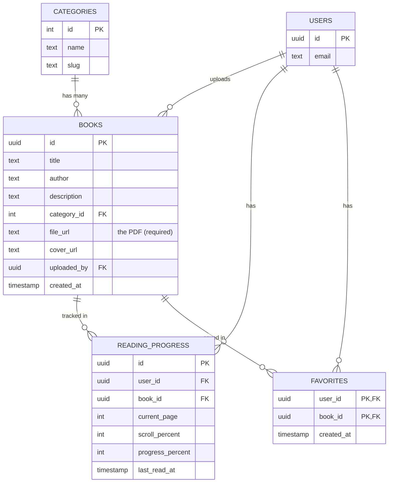

# OpenLibrary — Simple ER Diagram (4 tables)

**How to read it:** `USERS` is Supabase's own login table (`auth.users`) — you never create or edit it.

- One **category** has many **books** (Cybersecurity → many books). One-to-many.
- One **user** uploads many **books**. One-to-many.
- **READING_PROGRESS** connects a user and a book with *extra data* (page, percent). One-to-many from both sides through this table.
- **FAVORITES** is a pure many-to-many link: one user can favorite many books, one book can be favorited by many users. Its primary key is the pair `(user_id, book_id)`, so it needs no separate `id` column.
